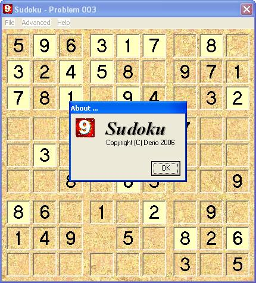



## Sudoku \- The Hot New Puzzle Craze

### Description

The Sudoku puzzle reached craze status in Japan in 2004 and the craze spread to the UK through the puzzle pages of national newspapers. The Daily Telegraph uses the name Sudoku, but you may see it called su doku elsewhere. However, there is no doubt that the word has been adopted into modern parlance, much like 'crossword'.

Sudoku is not a mathematical or arithmatical puzzle. It works just as well if the numbers are subtituted with letters or some other symbols, but number work best.

Sudoku consists of a 9x9 grid that has been subdivided into 9 smaller grids of 3x3 squares (I call it box). Each puzzle has a logical and unique solution. To solve the puzzle, each row, column and box must contain each of the numbers 1 to 9.
 
### More Info
 

             |
---                |---
**Submitted On**   |2006-08-23 00:17:34
**By**             |[Derio](https://github.com/Planet-Source-Code/PSCIndex/blob/master/ByAuthor/derio.md)
**Level**          |Beginner
**User Rating**    |5.0 (45 globes from 9 users)
**Compatibility**  |VB 5\.0, VB 6\.0
**Category**       |[Games](https://github.com/Planet-Source-Code/PSCIndex/blob/master/ByCategory/games__1-38.md)
**World**          |[Visual Basic](https://github.com/Planet-Source-Code/PSCIndex/blob/master/ByWorld/visual-basic.md)
**Archive File**   |[Sudoku\_\-\_T2015598242006\.zip](https://github.com/Planet-Source-Code/derio-sudoku-the-hot-new-puzzle-craze__1-66363/archive/master.zip)

